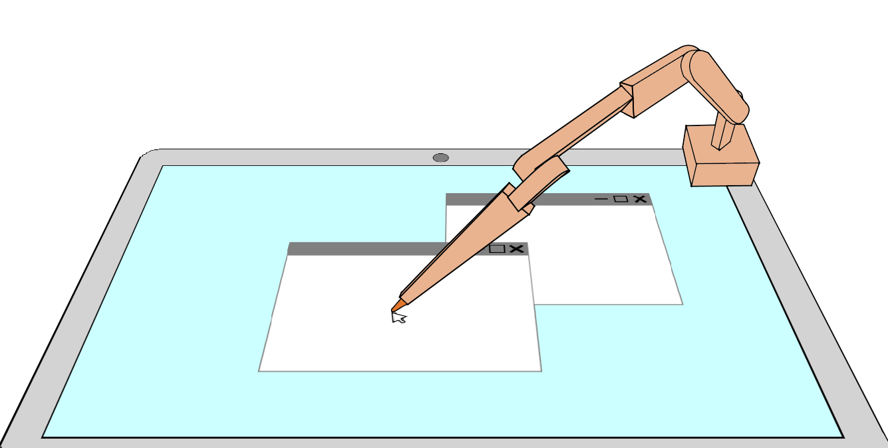

# VirtualTable
 A connection between an Arduino device and a computer, the device being in control of the computer's cursor with a robotic arm, following the principle of forward kinematics.
 
 
 
 ## -Work in progress-
